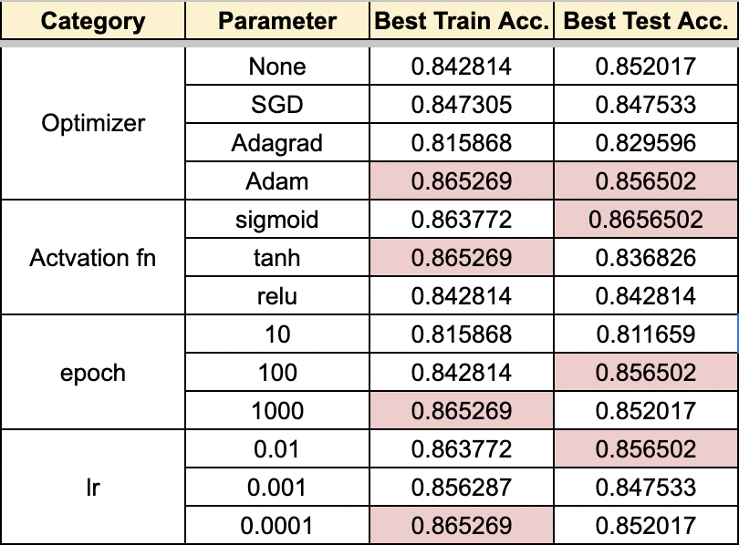

# ML Assignment 01

Submitted by : Aarushi Sethi (axs230077), Lavina

Step 1 : Download requirements.txt requirements using code and check if they have been installed 

- pip install -r requirements.txt
- pip list

Step 2 : To run the program once use run.sh. This will create a model as per the parameters specified. You can change them.
This includes the train_test_split_ratio that is set to 0.25 as default. 

- bash run.sh

Step 3 : To run the hyperparameter loops use the bash script - run-script.sh. 

- bash run-script.sh

The best results for the hyperparameter loop have been summarised in the table.  

## Pre-processing and cleaning the dataset

<aside>
💡 Information regarding the analysis and data_preprocessing found in the analysis_dataset.txt and preprocessing_dataset.txt logs files.

</aside>

- In the `run.py` file, in the analysis method of the `NNPipeline` class, the dataset is analysed. Its shape, the data type of the columns, the number of unique values in categorical data, and columns to be dropped are analysed. The logs and output of functions can be seen clearly in the `analysis_dataset.txt` file in the `logs` folder.
- After the data has been analysed for numerical columns, categorical columns, columns to drop and null-value containing columns, the data is preprocessed. The columns - `['PassengerId', 'Name', 'Ticket', 'Cabin']` - are dropped and the null values are filled for the columns age and embarked. After cleaning, data is transformed. The categorical data is one hot encoded and then the entire dataset is scaled with the help of the min-max scalar that helps make the data even due to the disparity in categorical and numerical columns. The logs for the preprocessing can be found in the `preprocessing_dataset.txt` in the `logs` folder.

## Train Test Split

<aside>
💡 Information regarding the dimensions of the data post the split can be found in the train_test_split_dataset.txt file in logs folder.

</aside>

- The train-test split is a hyperparameter, so it can vary. The `train_test_split_ratio` can be given as an argument while running the tests using the `run-script.sh` or `run.sh` bash file. The default value for the train_test_split_ratio is 0.25. Besides the ratio, a `random_state` is also defined that helps in replicating the results.
- The data is split in the `train_test_split` method of the `NNPipeline` class.

## Neural Network

- The layers need to create a simple ANN model are defined in the `layer.py` file. The summation layer is defined as a class called `NNLayer` and the activation layer is defined as a class called `ActivationLayer` .
- Each of the classes has a forward pass method that calculates the predicted output and a backward class method that updates the weights of the neuron.

## Optimizer

- The optimizers - `'SGDMomentum' 'AdaGrad' 'Adam’` have been coded in the `NN_optimizer.py` file.
- The update method in the respective classes is used to update the weights of the model as per the gradients. Each optimizer implements a different algorithm for updating the parameters, incorporating specific strategies to accelerate convergence.
- The hyperparameters for each activation function are different and can be changed in the `run-script.sh` or `run.sh` file.

## Activation Function

- The activation functions are used consistently throughout the model.
- The activation functions used are - `'sigmoid' 'tanh' 'relu’` and the activation functions and their derivatives have been defined in the `NN_activation.py` file.

## Training

- Done using the `train` method is `run.py`.
- The results for each model with different parameters are stored in `logs/train_logs` folder.

## Evaluation

- The evaluation is conducted using the `evaluate` method in `run.py`
- The results for each model with different parameters are stored in `logs/train_logs` folder.

## Results

The results have been summarised in the google sheets document here :
[Results - Learning rate, epochs, Activation Function, Optimizer](https://docs.google.com/spreadsheets/d/1G4C6pWE73lqlTGy_0edMtb8s73BmS8kH8pI0LzCAp0Y/edit?usp=sharing)

**General observations:**

- It can be observed by the logs that document the error and training accuracy that the error is always decreasing which indicates that gradient descent is working correctly. The training accuracy usually increases however it may decrease sometimes indicating oscillations around the minima.
- It can be observed that the smaller the learning rate, the slower the increase in accuracy.
- The more the epochs, the more the overall learning.
- Overall, there is only a small amount of over-fitting as observed from the little difference in training and testing accuracy.

**Specific observations:**

- Adam results in the best training and testing accuracy. Adam adjusts the learning rate for each parameter individually, based on the first and second moments of the gradients. This means that it can effectively handle sparse gradients and different scales of parameters.
- Sigmoid and Tanh activation functions both work well because they transform the input to a value between $[0,1]$ and $[-1,1]$ respectively. This characteristic can be particularly beneficial in tasks like binary classification, where we're often interested in predicting probabilities that lie within a specific range. Sigmoid is naturally suited for binary classification since its output can be interpreted as a probability.
- 100 and 1000 epochs both give high results but the range is similar. We can use early stopping and tradeoff little accuracy for computational time. It is trivial to note that 10 epochs do not produce high enough results.
- All learning rates eventually reach high accuracy but naturally smaller rates take more time.
- At the output layer, linear activation function produces better result than Sigmoid, Tanh, ReLu for the given dataset. To note : This is usually not the case, sigmoid performs well with binary classification but the results are subjective to the dataset.

## Resources

https://towardsdatascience.com/10-gradient-descent-optimisation-algorithms-86989510b5e9

https://towardsdatascience.com/math-neural-network-from-scratch-in-python-d6da9f29ce65
